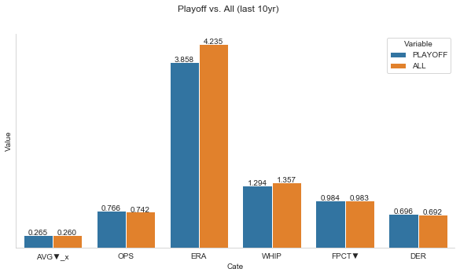
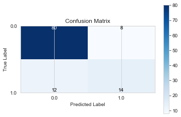

# Predict MLB

**Predict playoff odds for MLB teams**

## Let's predict odds for playoff

MLB.com provides the stats of the AL/NL teams such as Batting average, OPS (On-base  Plus Slugging), ERA (Earned Runs Average), WHIP(Walks Plus Hits Divided by Innings Pitched), etc. (http://mlb.mlb.com/stats/)

And there are API that provides get some stats of MLB with Python. You need to install it with 
``` pip install MLB-StatsAPI ```


Based on the Hitting, Pitching, and Fielding stats for division winners of the last 10 years,  let's try to make a machine learning model with classification methods. (Logistic Regression)

With this model, let's figure out which team is going to advance to the playoff.

If you only have some interest about the data set, you can find it [here](https://github.com/Teosoft7/predict_mlb/blob/master/mlb_stats/mlb_stading.csv)


```python
# import libraries
import numpy as np
import pandas as pd
import seaborn as sns

from matplotlib import pyplot as plt

# import MLB-StatsAPI
import statsapi as mlb
```

### Make a data set

MLB.com provide the stats of the MLB teams for Hitting, Pitching, and Fielding.

For more convenience, let's concatenate the 3 different sheets to one sheet.


```python
# Load data from CSV
hitting_df = pd.read_csv('mlb_stats/Hitting.csv')
hitting_df.head(3)
```


<div>
<style scoped>
    .dataframe tbody tr th:only-of-type {
        vertical-align: middle;
    }

    .dataframe tbody tr th {
        vertical-align: top;
    }

    .dataframe thead th {
        text-align: right;
    }
</style>
<table border="1" class="dataframe">
  <thead>
    <tr style="text-align: right;">
      <th></th>
      <th>Year</th>
      <th>RK</th>
      <th>Team</th>
      <th>League</th>
      <th>G</th>
      <th>AB</th>
      <th>R</th>
      <th>H</th>
      <th>2B</th>
      <th>3B</th>
      <th>HR</th>
      <th>RBI</th>
      <th>BB</th>
      <th>SO</th>
      <th>SB</th>
      <th>CS</th>
      <th>AVG▼</th>
      <th>OBP</th>
      <th>SLG</th>
      <th>OPS</th>
    </tr>
  </thead>
  <tbody>
    <tr>
      <th>0</th>
      <td>2018.0</td>
      <td>1</td>
      <td>Boston Red Sox</td>
      <td>AL</td>
      <td>162</td>
      <td>5623</td>
      <td>876</td>
      <td>1509</td>
      <td>355</td>
      <td>31</td>
      <td>208</td>
      <td>829</td>
      <td>569</td>
      <td>1253</td>
      <td>125</td>
      <td>31</td>
      <td>0.268</td>
      <td>0.339</td>
      <td>0.453</td>
      <td>0.792</td>
    </tr>
    <tr>
      <th>1</th>
      <td>NaN</td>
      <td>2</td>
      <td>Cleveland Indians</td>
      <td>AL</td>
      <td>162</td>
      <td>5595</td>
      <td>818</td>
      <td>1447</td>
      <td>297</td>
      <td>19</td>
      <td>216</td>
      <td>786</td>
      <td>554</td>
      <td>1189</td>
      <td>135</td>
      <td>36</td>
      <td>0.259</td>
      <td>0.332</td>
      <td>0.434</td>
      <td>0.766</td>
    </tr>
    <tr>
      <th>2</th>
      <td>NaN</td>
      <td>3</td>
      <td>Tampa Bay Rays</td>
      <td>AL</td>
      <td>162</td>
      <td>5475</td>
      <td>716</td>
      <td>1415</td>
      <td>274</td>
      <td>43</td>
      <td>150</td>
      <td>664</td>
      <td>540</td>
      <td>1388</td>
      <td>128</td>
      <td>51</td>
      <td>0.258</td>
      <td>0.333</td>
      <td>0.406</td>
      <td>0.740</td>
    </tr>
  </tbody>
</table>
</div>


```python
# Set Year Value for NaN
def set_year(df):
    """Set year value with previous year value for NaN"""
    for i, row in df.iterrows():
        if np.isnan(row['Year']):
            df.loc[i, 'Year'] = year
        else:
            year = row['Year']
```


```python
# Cleaning for Hitting
set_year(hitting_df)
hitting_df.head(3)
```


<div>
<style scoped>
    .dataframe tbody tr th:only-of-type {
        vertical-align: middle;
    }

    .dataframe tbody tr th {
        vertical-align: top;
    }

    .dataframe thead th {
        text-align: right;
    }
</style>
<table border="1" class="dataframe">
  <thead>
    <tr style="text-align: right;">
      <th></th>
      <th>Year</th>
      <th>RK</th>
      <th>Team</th>
      <th>League</th>
      <th>G</th>
      <th>AB</th>
      <th>R</th>
      <th>H</th>
      <th>2B</th>
      <th>3B</th>
      <th>HR</th>
      <th>RBI</th>
      <th>BB</th>
      <th>SO</th>
      <th>SB</th>
      <th>CS</th>
      <th>AVG▼</th>
      <th>OBP</th>
      <th>SLG</th>
      <th>OPS</th>
    </tr>
  </thead>
  <tbody>
    <tr>
      <th>0</th>
      <td>2018.0</td>
      <td>1</td>
      <td>Boston Red Sox</td>
      <td>AL</td>
      <td>162</td>
      <td>5623</td>
      <td>876</td>
      <td>1509</td>
      <td>355</td>
      <td>31</td>
      <td>208</td>
      <td>829</td>
      <td>569</td>
      <td>1253</td>
      <td>125</td>
      <td>31</td>
      <td>0.268</td>
      <td>0.339</td>
      <td>0.453</td>
      <td>0.792</td>
    </tr>
    <tr>
      <th>1</th>
      <td>2018.0</td>
      <td>2</td>
      <td>Cleveland Indians</td>
      <td>AL</td>
      <td>162</td>
      <td>5595</td>
      <td>818</td>
      <td>1447</td>
      <td>297</td>
      <td>19</td>
      <td>216</td>
      <td>786</td>
      <td>554</td>
      <td>1189</td>
      <td>135</td>
      <td>36</td>
      <td>0.259</td>
      <td>0.332</td>
      <td>0.434</td>
      <td>0.766</td>
    </tr>
    <tr>
      <th>2</th>
      <td>2018.0</td>
      <td>3</td>
      <td>Tampa Bay Rays</td>
      <td>AL</td>
      <td>162</td>
      <td>5475</td>
      <td>716</td>
      <td>1415</td>
      <td>274</td>
      <td>43</td>
      <td>150</td>
      <td>664</td>
      <td>540</td>
      <td>1388</td>
      <td>128</td>
      <td>51</td>
      <td>0.258</td>
      <td>0.333</td>
      <td>0.406</td>
      <td>0.740</td>
    </tr>
  </tbody>
</table>
</div>


```python
# Loading Pitching
pitching_df = pd.read_csv('mlb_stats/Pictching.csv')
pitching_df.head(3)
```


<div>
<style scoped>
    .dataframe tbody tr th:only-of-type {
        vertical-align: middle;
    }

    .dataframe tbody tr th {
        vertical-align: top;
    }

    .dataframe thead th {
        text-align: right;
    }
</style>
<table border="1" class="dataframe">
  <thead>
    <tr style="text-align: right;">
      <th></th>
      <th>Year</th>
      <th>RK</th>
      <th>Team</th>
      <th>League</th>
      <th>W</th>
      <th>L</th>
      <th>ERA</th>
      <th>G</th>
      <th>GS</th>
      <th>SV</th>
      <th>SVO</th>
      <th>IP</th>
      <th>H</th>
      <th>R</th>
      <th>ER</th>
      <th>HR</th>
      <th>BB</th>
      <th>SO</th>
      <th>AVG▼</th>
      <th>WHIP</th>
    </tr>
  </thead>
  <tbody>
    <tr>
      <th>0</th>
      <td>2018.0</td>
      <td>1</td>
      <td>Baltimore Orioles</td>
      <td>AL</td>
      <td>47</td>
      <td>115</td>
      <td>5.18</td>
      <td>162</td>
      <td>162</td>
      <td>28</td>
      <td>46</td>
      <td>1431.0</td>
      <td>1552</td>
      <td>892</td>
      <td>824</td>
      <td>234</td>
      <td>589</td>
      <td>1203</td>
      <td>0.276</td>
      <td>1.50</td>
    </tr>
    <tr>
      <th>1</th>
      <td>NaN</td>
      <td>2</td>
      <td>Kansas City Royals</td>
      <td>AL</td>
      <td>58</td>
      <td>104</td>
      <td>4.94</td>
      <td>162</td>
      <td>162</td>
      <td>33</td>
      <td>57</td>
      <td>1432.0</td>
      <td>1542</td>
      <td>833</td>
      <td>786</td>
      <td>205</td>
      <td>549</td>
      <td>1157</td>
      <td>0.275</td>
      <td>1.46</td>
    </tr>
    <tr>
      <th>2</th>
      <td>NaN</td>
      <td>3</td>
      <td>Texas Rangers</td>
      <td>AL</td>
      <td>67</td>
      <td>95</td>
      <td>4.92</td>
      <td>162</td>
      <td>162</td>
      <td>42</td>
      <td>56</td>
      <td>1431.0</td>
      <td>1516</td>
      <td>848</td>
      <td>783</td>
      <td>222</td>
      <td>491</td>
      <td>1121</td>
      <td>0.271</td>
      <td>1.40</td>
    </tr>
  </tbody>
</table>
</div>


```python
# Cleaning Pitching
set_year(pitching_df)
pitching_df.head(3)
```


<div>
<style scoped>
    .dataframe tbody tr th:only-of-type {
        vertical-align: middle;
    }

    .dataframe tbody tr th {
        vertical-align: top;
    }

    .dataframe thead th {
        text-align: right;
    }
</style>
<table border="1" class="dataframe">
  <thead>
    <tr style="text-align: right;">
      <th></th>
      <th>Year</th>
      <th>RK</th>
      <th>Team</th>
      <th>League</th>
      <th>W</th>
      <th>L</th>
      <th>ERA</th>
      <th>G</th>
      <th>GS</th>
      <th>SV</th>
      <th>SVO</th>
      <th>IP</th>
      <th>H</th>
      <th>R</th>
      <th>ER</th>
      <th>HR</th>
      <th>BB</th>
      <th>SO</th>
      <th>AVG▼</th>
      <th>WHIP</th>
    </tr>
  </thead>
  <tbody>
    <tr>
      <th>0</th>
      <td>2018.0</td>
      <td>1</td>
      <td>Baltimore Orioles</td>
      <td>AL</td>
      <td>47</td>
      <td>115</td>
      <td>5.18</td>
      <td>162</td>
      <td>162</td>
      <td>28</td>
      <td>46</td>
      <td>1431.0</td>
      <td>1552</td>
      <td>892</td>
      <td>824</td>
      <td>234</td>
      <td>589</td>
      <td>1203</td>
      <td>0.276</td>
      <td>1.50</td>
    </tr>
    <tr>
      <th>1</th>
      <td>2018.0</td>
      <td>2</td>
      <td>Kansas City Royals</td>
      <td>AL</td>
      <td>58</td>
      <td>104</td>
      <td>4.94</td>
      <td>162</td>
      <td>162</td>
      <td>33</td>
      <td>57</td>
      <td>1432.0</td>
      <td>1542</td>
      <td>833</td>
      <td>786</td>
      <td>205</td>
      <td>549</td>
      <td>1157</td>
      <td>0.275</td>
      <td>1.46</td>
    </tr>
    <tr>
      <th>2</th>
      <td>2018.0</td>
      <td>3</td>
      <td>Texas Rangers</td>
      <td>AL</td>
      <td>67</td>
      <td>95</td>
      <td>4.92</td>
      <td>162</td>
      <td>162</td>
      <td>42</td>
      <td>56</td>
      <td>1431.0</td>
      <td>1516</td>
      <td>848</td>
      <td>783</td>
      <td>222</td>
      <td>491</td>
      <td>1121</td>
      <td>0.271</td>
      <td>1.40</td>
    </tr>
  </tbody>
</table>
</div>


```python
# Loading Fielding
fielding_df = pd.read_csv('mlb_stats/Fielding.csv')
fielding_df.head(3)
```


<div>
<style scoped>
    .dataframe tbody tr th:only-of-type {
        vertical-align: middle;
    }

    .dataframe tbody tr th {
        vertical-align: top;
    }

    .dataframe thead th {
        text-align: right;
    }
</style>
<table border="1" class="dataframe">
  <thead>
    <tr style="text-align: right;">
      <th></th>
      <th>Year</th>
      <th>RK</th>
      <th>Team</th>
      <th>League</th>
      <th>G</th>
      <th>GS</th>
      <th>INN</th>
      <th>TC</th>
      <th>PO</th>
      <th>A</th>
      <th>E</th>
      <th>DP</th>
      <th>SB</th>
      <th>CS</th>
      <th>SBPCT</th>
      <th>PB</th>
      <th>C_WP</th>
      <th>FPCT▼</th>
      <th>DER</th>
    </tr>
  </thead>
  <tbody>
    <tr>
      <th>0</th>
      <td>2018.0</td>
      <td>1</td>
      <td>Houston Astros</td>
      <td>AL</td>
      <td>162</td>
      <td>1458</td>
      <td>13095.0</td>
      <td>5797</td>
      <td>4365</td>
      <td>1369</td>
      <td>63</td>
      <td>116</td>
      <td>60</td>
      <td>25</td>
      <td>0.706</td>
      <td>15</td>
      <td>67</td>
      <td>0.989</td>
      <td>0.707</td>
    </tr>
    <tr>
      <th>1</th>
      <td>NaN</td>
      <td>2</td>
      <td>Washington Nationals</td>
      <td>NL</td>
      <td>162</td>
      <td>1458</td>
      <td>13014.0</td>
      <td>5765</td>
      <td>4338</td>
      <td>1363</td>
      <td>64</td>
      <td>115</td>
      <td>75</td>
      <td>43</td>
      <td>0.636</td>
      <td>10</td>
      <td>42</td>
      <td>0.989</td>
      <td>0.703</td>
    </tr>
    <tr>
      <th>2</th>
      <td>NaN</td>
      <td>3</td>
      <td>Arizona Diamondbacks</td>
      <td>NL</td>
      <td>162</td>
      <td>1458</td>
      <td>13167.0</td>
      <td>6150</td>
      <td>4389</td>
      <td>1686</td>
      <td>75</td>
      <td>152</td>
      <td>66</td>
      <td>27</td>
      <td>0.710</td>
      <td>6</td>
      <td>69</td>
      <td>0.988</td>
      <td>0.699</td>
    </tr>
  </tbody>
</table>
</div>


```python
# Cleaning Fielding
set_year(fielding_df)
fielding_df.head(3)
```


<div>
<style scoped>
    .dataframe tbody tr th:only-of-type {
        vertical-align: middle;
    }

    .dataframe tbody tr th {
        vertical-align: top;
    }

    .dataframe thead th {
        text-align: right;
    }
</style>
<table border="1" class="dataframe">
  <thead>
    <tr style="text-align: right;">
      <th></th>
      <th>Year</th>
      <th>RK</th>
      <th>Team</th>
      <th>League</th>
      <th>G</th>
      <th>GS</th>
      <th>INN</th>
      <th>TC</th>
      <th>PO</th>
      <th>A</th>
      <th>E</th>
      <th>DP</th>
      <th>SB</th>
      <th>CS</th>
      <th>SBPCT</th>
      <th>PB</th>
      <th>C_WP</th>
      <th>FPCT▼</th>
      <th>DER</th>
    </tr>
  </thead>
  <tbody>
    <tr>
      <th>0</th>
      <td>2018.0</td>
      <td>1</td>
      <td>Houston Astros</td>
      <td>AL</td>
      <td>162</td>
      <td>1458</td>
      <td>13095.0</td>
      <td>5797</td>
      <td>4365</td>
      <td>1369</td>
      <td>63</td>
      <td>116</td>
      <td>60</td>
      <td>25</td>
      <td>0.706</td>
      <td>15</td>
      <td>67</td>
      <td>0.989</td>
      <td>0.707</td>
    </tr>
    <tr>
      <th>1</th>
      <td>2018.0</td>
      <td>2</td>
      <td>Washington Nationals</td>
      <td>NL</td>
      <td>162</td>
      <td>1458</td>
      <td>13014.0</td>
      <td>5765</td>
      <td>4338</td>
      <td>1363</td>
      <td>64</td>
      <td>115</td>
      <td>75</td>
      <td>43</td>
      <td>0.636</td>
      <td>10</td>
      <td>42</td>
      <td>0.989</td>
      <td>0.703</td>
    </tr>
    <tr>
      <th>2</th>
      <td>2018.0</td>
      <td>3</td>
      <td>Arizona Diamondbacks</td>
      <td>NL</td>
      <td>162</td>
      <td>1458</td>
      <td>13167.0</td>
      <td>6150</td>
      <td>4389</td>
      <td>1686</td>
      <td>75</td>
      <td>152</td>
      <td>66</td>
      <td>27</td>
      <td>0.710</td>
      <td>6</td>
      <td>69</td>
      <td>0.988</td>
      <td>0.699</td>
    </tr>
  </tbody>
</table>
</div>


```python
# Make a single data frame with join method
# temp_df = hitting_df.join(pitching_df, on=['Year', 'Team'], how="left")
temp_df = pd.merge(hitting_df, pitching_df, how='left', on=['Year', 'Team'])
```


```python
temp_df.head()
```


<div>
<style scoped>
    .dataframe tbody tr th:only-of-type {
        vertical-align: middle;
    }

    .dataframe tbody tr th {
        vertical-align: top;
    }

    .dataframe thead th {
        text-align: right;
    }
</style>
<table border="1" class="dataframe">
  <thead>
    <tr style="text-align: right;">
      <th></th>
      <th>Year</th>
      <th>RK_x</th>
      <th>Team</th>
      <th>League_x</th>
      <th>G_x</th>
      <th>AB</th>
      <th>R_x</th>
      <th>H_x</th>
      <th>2B</th>
      <th>3B</th>
      <th>...</th>
      <th>SVO</th>
      <th>IP</th>
      <th>H_y</th>
      <th>R_y</th>
      <th>ER</th>
      <th>HR_y</th>
      <th>BB_y</th>
      <th>SO_y</th>
      <th>AVG▼_y</th>
      <th>WHIP</th>
    </tr>
  </thead>
  <tbody>
    <tr>
      <th>0</th>
      <td>2018.0</td>
      <td>1</td>
      <td>Boston Red Sox</td>
      <td>AL</td>
      <td>162</td>
      <td>5623</td>
      <td>876</td>
      <td>1509</td>
      <td>355</td>
      <td>31</td>
      <td>...</td>
      <td>66</td>
      <td>1458.2</td>
      <td>1305</td>
      <td>647</td>
      <td>608</td>
      <td>176</td>
      <td>512</td>
      <td>1558</td>
      <td>0.237</td>
      <td>1.25</td>
    </tr>
    <tr>
      <th>1</th>
      <td>2018.0</td>
      <td>2</td>
      <td>Cleveland Indians</td>
      <td>AL</td>
      <td>162</td>
      <td>5595</td>
      <td>818</td>
      <td>1447</td>
      <td>297</td>
      <td>19</td>
      <td>...</td>
      <td>58</td>
      <td>1457.1</td>
      <td>1349</td>
      <td>648</td>
      <td>611</td>
      <td>200</td>
      <td>407</td>
      <td>1544</td>
      <td>0.242</td>
      <td>1.20</td>
    </tr>
    <tr>
      <th>2</th>
      <td>2018.0</td>
      <td>3</td>
      <td>Tampa Bay Rays</td>
      <td>AL</td>
      <td>162</td>
      <td>5475</td>
      <td>716</td>
      <td>1415</td>
      <td>274</td>
      <td>43</td>
      <td>...</td>
      <td>74</td>
      <td>1448.1</td>
      <td>1236</td>
      <td>646</td>
      <td>602</td>
      <td>164</td>
      <td>501</td>
      <td>1421</td>
      <td>0.230</td>
      <td>1.20</td>
    </tr>
    <tr>
      <th>3</th>
      <td>2018.0</td>
      <td>4</td>
      <td>Chicago Cubs</td>
      <td>NL</td>
      <td>163</td>
      <td>5624</td>
      <td>761</td>
      <td>1453</td>
      <td>286</td>
      <td>34</td>
      <td>...</td>
      <td>65</td>
      <td>1476.1</td>
      <td>1319</td>
      <td>645</td>
      <td>598</td>
      <td>157</td>
      <td>622</td>
      <td>1333</td>
      <td>0.240</td>
      <td>1.31</td>
    </tr>
    <tr>
      <th>4</th>
      <td>2018.0</td>
      <td>5</td>
      <td>Atlanta Braves</td>
      <td>NL</td>
      <td>162</td>
      <td>5582</td>
      <td>759</td>
      <td>1433</td>
      <td>314</td>
      <td>29</td>
      <td>...</td>
      <td>60</td>
      <td>1456.2</td>
      <td>1236</td>
      <td>657</td>
      <td>607</td>
      <td>153</td>
      <td>635</td>
      <td>1423</td>
      <td>0.229</td>
      <td>1.28</td>
    </tr>
  </tbody>
</table>
<p>5 rows × 38 columns</p>
</div>


```python
df = pd.merge(temp_df, fielding_df, how='left', on=['Year', 'Team'])
```


```python
df.head()
```


<div>
<style scoped>
    .dataframe tbody tr th:only-of-type {
        vertical-align: middle;
    }

    .dataframe tbody tr th {
        vertical-align: top;
    }

    .dataframe thead th {
        text-align: right;
    }
</style>
<table border="1" class="dataframe">
  <thead>
    <tr style="text-align: right;">
      <th></th>
      <th>Year</th>
      <th>RK_x</th>
      <th>Team</th>
      <th>League_x</th>
      <th>G_x</th>
      <th>AB</th>
      <th>R_x</th>
      <th>H_x</th>
      <th>2B</th>
      <th>3B</th>
      <th>...</th>
      <th>A</th>
      <th>E</th>
      <th>DP</th>
      <th>SB_y</th>
      <th>CS_y</th>
      <th>SBPCT</th>
      <th>PB</th>
      <th>C_WP</th>
      <th>FPCT▼</th>
      <th>DER</th>
    </tr>
  </thead>
  <tbody>
    <tr>
      <th>0</th>
      <td>2018.0</td>
      <td>1</td>
      <td>Boston Red Sox</td>
      <td>AL</td>
      <td>162</td>
      <td>5623</td>
      <td>876</td>
      <td>1509</td>
      <td>355</td>
      <td>31</td>
      <td>...</td>
      <td>1366</td>
      <td>77</td>
      <td>106</td>
      <td>64</td>
      <td>30</td>
      <td>0.681</td>
      <td>25</td>
      <td>51</td>
      <td>0.987</td>
      <td>0.694</td>
    </tr>
    <tr>
      <th>1</th>
      <td>2018.0</td>
      <td>2</td>
      <td>Cleveland Indians</td>
      <td>AL</td>
      <td>162</td>
      <td>5595</td>
      <td>818</td>
      <td>1447</td>
      <td>297</td>
      <td>19</td>
      <td>...</td>
      <td>1353</td>
      <td>83</td>
      <td>123</td>
      <td>81</td>
      <td>29</td>
      <td>0.736</td>
      <td>9</td>
      <td>54</td>
      <td>0.986</td>
      <td>0.689</td>
    </tr>
    <tr>
      <th>2</th>
      <td>2018.0</td>
      <td>3</td>
      <td>Tampa Bay Rays</td>
      <td>AL</td>
      <td>162</td>
      <td>5475</td>
      <td>716</td>
      <td>1415</td>
      <td>274</td>
      <td>43</td>
      <td>...</td>
      <td>1483</td>
      <td>85</td>
      <td>136</td>
      <td>78</td>
      <td>27</td>
      <td>0.743</td>
      <td>17</td>
      <td>55</td>
      <td>0.986</td>
      <td>0.709</td>
    </tr>
    <tr>
      <th>3</th>
      <td>2018.0</td>
      <td>4</td>
      <td>Chicago Cubs</td>
      <td>NL</td>
      <td>163</td>
      <td>5624</td>
      <td>761</td>
      <td>1453</td>
      <td>286</td>
      <td>34</td>
      <td>...</td>
      <td>1675</td>
      <td>104</td>
      <td>155</td>
      <td>84</td>
      <td>40</td>
      <td>0.677</td>
      <td>12</td>
      <td>46</td>
      <td>0.983</td>
      <td>0.702</td>
    </tr>
    <tr>
      <th>4</th>
      <td>2018.0</td>
      <td>5</td>
      <td>Atlanta Braves</td>
      <td>NL</td>
      <td>162</td>
      <td>5582</td>
      <td>759</td>
      <td>1433</td>
      <td>314</td>
      <td>29</td>
      <td>...</td>
      <td>1439</td>
      <td>80</td>
      <td>134</td>
      <td>102</td>
      <td>28</td>
      <td>0.785</td>
      <td>13</td>
      <td>61</td>
      <td>0.986</td>
      <td>0.710</td>
    </tr>
  </tbody>
</table>
<p>5 rows × 55 columns</p>
</div>


#### Get rank by year from MLB api


```python
# get stading from mlb api
standing_2018 = mlb.standings(season=2018, standingsTypes='byLeague')
print(standing_2018)
```

    American League East
    Rank Team                   W   L   GB  (E#) WC Rank WC GB (E#)
     1   Boston Red Sox        108 54   -    -      -      -    E  
     2   New York Yankees      100 62  8.0   E      1    +3.0   -  
     3   Tampa Bay Rays        90  72  18.0  E      3     7.0   E  
     4   Toronto Blue Jays     73  89  35.0  E      7    24.0   E  
     5   Baltimore Orioles     47  115 61.0  E     12    50.0   E  
    
    American League West
    Rank Team                   W   L   GB  (E#) WC Rank WC GB (E#)
     1   Houston Astros        103 59   -    -      -      -    E  
     2   Oakland Athletics     97  65  6.0   E      2      -    -  
     3   Seattle Mariners      89  73  14.0  E      4     8.0   E  
     4   Los Angeles Angels    80  82  23.0  E      5    17.0   E  
     5   Texas Rangers         67  95  36.0  E      8    30.0   E  
    
    American League Central
    Rank Team                   W   L   GB  (E#) WC Rank WC GB (E#)
     1   Cleveland Indians     91  71   -    -      -      -    E  
     2   Minnesota Twins       78  84  13.0  E      6    19.0   E  
     3   Detroit Tigers        64  98  27.0  E      9    33.0   E  
     4   Chicago White Sox     62  100 29.0  E     10    35.0   E  
     5   Kansas City Royals    58  104 33.0  E     11    39.0   E  
    
    National League Central
    Rank Team                   W   L   GB  (E#) WC Rank WC GB (E#)
     1   Milwaukee Brewers     96  67   -    -      -      -    E  
     2   Chicago Cubs          95  68  1.0   E      1    +4.0   -  
     3   St. Louis Cardinals   88  74  7.5   E      3     2.5   E  
     4   Pittsburgh Pirates    82  79  13.0  E      4     8.0   E  
     5   Cincinnati Reds       67  95  28.5  E     10    23.5   E  
    
    National League West
    Rank Team                   W   L   GB  (E#) WC Rank WC GB (E#)
     1   Los Angeles Dodgers   92  71   -    -      -      -    E  
     2   Colorado Rockies      91  72  1.0   E      2      -    -  
     3   Arizona Diamondbacks  82  80  9.5   E      5     8.5   E  
     4   San Francisco Giants  73  89  18.5  E      9    17.5   E  
     5   San Diego Padres      66  96  25.5  E     11    24.5   E  
    
    National League East
    Rank Team                   W   L   GB  (E#) WC Rank WC GB (E#)
     1   Atlanta Braves        90  72   -    -      -      -    E  
     2   Washington Nationals  82  80  8.0   E      6     8.5   E  
     3   Philadelphia Phillies 80  82  10.0  E      7    10.5   E  
     4   New York Mets         77  85  13.0  E      8    13.5   E  
     5   Miami Marlins         63  98  26.5  E     12    27.0   E  
    
    


```python
# Set the rank for dataframe with mlb api standings
prev_year = ''
for i, row in df.iterrows():
    year = row['Year']
    team = row['Team']
    
    # get standings by calling the mlb API
    if prev_year != year:
        standings = mlb.standings(season=year).split('\n')
    prev_year = year

    for standing in standings:
        if standing.find(team) != -1:
            # Found the team and
            if '1' in standing.split(' '):
                # if contains '1' means division winner or WC winner
                df.loc[i, 'Playoff'] = 1
#                 print(f'{team} {year} advanced to playoff')
            else:
                df.loc[i, 'Playoff'] = 0                
#                 print(f'{team} {year} failed to advance playoff')
            continue
#     else:
#         # If team does not found on the standings from MLB API
#         # Assume it, failed to playoff
#         print(f'{team} {year} is not on the list !!!')
#         df.loc[i, 'Playoff'] = 0
```


```python
# Check new values
df['Playoff'].unique()
```


    array([1., 0.])


```python
df.head()
```


<div>
<style scoped>
    .dataframe tbody tr th:only-of-type {
        vertical-align: middle;
    }

    .dataframe tbody tr th {
        vertical-align: top;
    }

    .dataframe thead th {
        text-align: right;
    }
</style>
<table border="1" class="dataframe">
  <thead>
    <tr style="text-align: right;">
      <th></th>
      <th>Year</th>
      <th>RK_x</th>
      <th>Team</th>
      <th>League_x</th>
      <th>G_x</th>
      <th>AB</th>
      <th>R_x</th>
      <th>H_x</th>
      <th>2B</th>
      <th>3B</th>
      <th>...</th>
      <th>E</th>
      <th>DP</th>
      <th>SB_y</th>
      <th>CS_y</th>
      <th>SBPCT</th>
      <th>PB</th>
      <th>C_WP</th>
      <th>FPCT▼</th>
      <th>DER</th>
      <th>Playoff</th>
    </tr>
  </thead>
  <tbody>
    <tr>
      <th>0</th>
      <td>2018.0</td>
      <td>1</td>
      <td>Boston Red Sox</td>
      <td>AL</td>
      <td>162</td>
      <td>5623</td>
      <td>876</td>
      <td>1509</td>
      <td>355</td>
      <td>31</td>
      <td>...</td>
      <td>77</td>
      <td>106</td>
      <td>64</td>
      <td>30</td>
      <td>0.681</td>
      <td>25</td>
      <td>51</td>
      <td>0.987</td>
      <td>0.694</td>
      <td>1.0</td>
    </tr>
    <tr>
      <th>1</th>
      <td>2018.0</td>
      <td>2</td>
      <td>Cleveland Indians</td>
      <td>AL</td>
      <td>162</td>
      <td>5595</td>
      <td>818</td>
      <td>1447</td>
      <td>297</td>
      <td>19</td>
      <td>...</td>
      <td>83</td>
      <td>123</td>
      <td>81</td>
      <td>29</td>
      <td>0.736</td>
      <td>9</td>
      <td>54</td>
      <td>0.986</td>
      <td>0.689</td>
      <td>1.0</td>
    </tr>
    <tr>
      <th>2</th>
      <td>2018.0</td>
      <td>3</td>
      <td>Tampa Bay Rays</td>
      <td>AL</td>
      <td>162</td>
      <td>5475</td>
      <td>716</td>
      <td>1415</td>
      <td>274</td>
      <td>43</td>
      <td>...</td>
      <td>85</td>
      <td>136</td>
      <td>78</td>
      <td>27</td>
      <td>0.743</td>
      <td>17</td>
      <td>55</td>
      <td>0.986</td>
      <td>0.709</td>
      <td>0.0</td>
    </tr>
    <tr>
      <th>3</th>
      <td>2018.0</td>
      <td>4</td>
      <td>Chicago Cubs</td>
      <td>NL</td>
      <td>163</td>
      <td>5624</td>
      <td>761</td>
      <td>1453</td>
      <td>286</td>
      <td>34</td>
      <td>...</td>
      <td>104</td>
      <td>155</td>
      <td>84</td>
      <td>40</td>
      <td>0.677</td>
      <td>12</td>
      <td>46</td>
      <td>0.983</td>
      <td>0.702</td>
      <td>1.0</td>
    </tr>
    <tr>
      <th>4</th>
      <td>2018.0</td>
      <td>5</td>
      <td>Atlanta Braves</td>
      <td>NL</td>
      <td>162</td>
      <td>5582</td>
      <td>759</td>
      <td>1433</td>
      <td>314</td>
      <td>29</td>
      <td>...</td>
      <td>80</td>
      <td>134</td>
      <td>102</td>
      <td>28</td>
      <td>0.785</td>
      <td>13</td>
      <td>61</td>
      <td>0.986</td>
      <td>0.710</td>
      <td>1.0</td>
    </tr>
  </tbody>
</table>
<p>5 rows × 56 columns</p>
</div>


```python
# Save to CSV file
df.to_csv('mlb_stats/mlb_stading.csv')
```

## Data Understanding


```python
# Set seaborn style
sns.set_style('whitegrid')
```

### Constrain about data

Most variable in data set is a result value from whole season(162 games), but in terms of predict the odds of playoff,    
it means the season is not over yet. 
The number of hits, runs, homeruns could be less than at the end of season.    

First of all, let's start with variables from **ratio**.  

We could use.  
- AVG▼_x : Batting Average
- OPS : On base Plus Slugging
- ERA : Earned Run Average
- WHIP : Walks plus Hits divided by Innings Pitched
- FPCT▼ : Fielding PerCenTage
- DEF : Defense Efficiency Ratio (1 - ((H + ROE - HR) / (PA - BB - SO - HBP - HR)))


```python
# Set features with Batting AVG, OPS, ERA, Pitching AVG, WHIP, FPCT, DER
features = ['AVG▼_x', 'OPS' , 'ERA', 'WHIP', 'FPCT▼', 'DER']
```


```python
# Let's check the features for advanced team
df.loc[df['Playoff'] == 1, features].describe()
```


<div>
<style scoped>
    .dataframe tbody tr th:only-of-type {
        vertical-align: middle;
    }

    .dataframe tbody tr th {
        vertical-align: top;
    }

    .dataframe thead th {
        text-align: right;
    }
</style>
<table border="1" class="dataframe">
  <thead>
    <tr style="text-align: right;">
      <th></th>
      <th>AVG▼_x</th>
      <th>OPS</th>
      <th>ERA</th>
      <th>WHIP</th>
      <th>FPCT▼</th>
      <th>DER</th>
    </tr>
  </thead>
  <tbody>
    <tr>
      <th>count</th>
      <td>152.000000</td>
      <td>152.000000</td>
      <td>152.000000</td>
      <td>152.000000</td>
      <td>152.000000</td>
      <td>152.000000</td>
    </tr>
    <tr>
      <th>mean</th>
      <td>0.265368</td>
      <td>0.765901</td>
      <td>3.857829</td>
      <td>1.293684</td>
      <td>0.984237</td>
      <td>0.696421</td>
    </tr>
    <tr>
      <th>std</th>
      <td>0.011196</td>
      <td>0.032390</td>
      <td>0.389936</td>
      <td>0.071675</td>
      <td>0.002272</td>
      <td>0.010318</td>
    </tr>
    <tr>
      <th>min</th>
      <td>0.238000</td>
      <td>0.689000</td>
      <td>2.940000</td>
      <td>1.100000</td>
      <td>0.978000</td>
      <td>0.672000</td>
    </tr>
    <tr>
      <th>25%</th>
      <td>0.257000</td>
      <td>0.739750</td>
      <td>3.590000</td>
      <td>1.240000</td>
      <td>0.983000</td>
      <td>0.689000</td>
    </tr>
    <tr>
      <th>50%</th>
      <td>0.265000</td>
      <td>0.767000</td>
      <td>3.835000</td>
      <td>1.290000</td>
      <td>0.984000</td>
      <td>0.695500</td>
    </tr>
    <tr>
      <th>75%</th>
      <td>0.273000</td>
      <td>0.786000</td>
      <td>4.105000</td>
      <td>1.332500</td>
      <td>0.986000</td>
      <td>0.703250</td>
    </tr>
    <tr>
      <th>max</th>
      <td>0.290000</td>
      <td>0.851000</td>
      <td>4.760000</td>
      <td>1.500000</td>
      <td>0.989000</td>
      <td>0.731000</td>
    </tr>
  </tbody>
</table>
</div>


```python
# Compare with all teams
df[features].describe()
```


<div>
<style scoped>
    .dataframe tbody tr th:only-of-type {
        vertical-align: middle;
    }

    .dataframe tbody tr th {
        vertical-align: top;
    }

    .dataframe thead th {
        text-align: right;
    }
</style>
<table border="1" class="dataframe">
  <thead>
    <tr style="text-align: right;">
      <th></th>
      <th>AVG▼_x</th>
      <th>OPS</th>
      <th>ERA</th>
      <th>WHIP</th>
      <th>FPCT▼</th>
      <th>DER</th>
    </tr>
  </thead>
  <tbody>
    <tr>
      <th>count</th>
      <td>570.000000</td>
      <td>570.000000</td>
      <td>570.000000</td>
      <td>570.000000</td>
      <td>570.000000</td>
      <td>570.000000</td>
    </tr>
    <tr>
      <th>mean</th>
      <td>0.259825</td>
      <td>0.742154</td>
      <td>4.235070</td>
      <td>1.357193</td>
      <td>0.983405</td>
      <td>0.691512</td>
    </tr>
    <tr>
      <th>std</th>
      <td>0.012099</td>
      <td>0.038300</td>
      <td>0.529807</td>
      <td>0.094699</td>
      <td>0.002638</td>
      <td>0.010800</td>
    </tr>
    <tr>
      <th>min</th>
      <td>0.226000</td>
      <td>0.627000</td>
      <td>2.940000</td>
      <td>1.100000</td>
      <td>0.976000</td>
      <td>0.655000</td>
    </tr>
    <tr>
      <th>25%</th>
      <td>0.251000</td>
      <td>0.716000</td>
      <td>3.850000</td>
      <td>1.290000</td>
      <td>0.982000</td>
      <td>0.684000</td>
    </tr>
    <tr>
      <th>50%</th>
      <td>0.260000</td>
      <td>0.741500</td>
      <td>4.200000</td>
      <td>1.360000</td>
      <td>0.983000</td>
      <td>0.692000</td>
    </tr>
    <tr>
      <th>75%</th>
      <td>0.268000</td>
      <td>0.768750</td>
      <td>4.597500</td>
      <td>1.420000</td>
      <td>0.985000</td>
      <td>0.699000</td>
    </tr>
    <tr>
      <th>max</th>
      <td>0.294000</td>
      <td>0.851000</td>
      <td>5.710000</td>
      <td>1.640000</td>
      <td>0.991000</td>
      <td>0.731000</td>
    </tr>
  </tbody>
</table>
</div>


```python
# get average stat for Playoff qualifiers to list
playoff = df.loc[df['Playoff'] == 1, features].mean()
```


```python
# get average stat for All teams to list
all = df.loc[:, features].mean()
```


```python
# make a DataFrame with playoff and all 
feature_df = pd.DataFrame(zip(features,playoff,all), columns=['CATE','PLAYOFF', 'ALL'])
```


```python
fig, ax = plt.subplots(figsize=(10, 5))
graph_df = feature_df.melt(id_vars='CATE').rename(columns=str.title)
sns.barplot(x='Cate', y='Value', hue='Variable', data=graph_df, ax=ax)
sns.despine(fig)

ax.grid(False)
ax.set_yticks([])

fig.suptitle('Playoff vs. All (last 10yr)')

for rect in ax.patches:
    y_value = rect.get_height()
    x_value = rect.get_x() + rect.get_width() / 2

    label = '{:.3f}'.format(y_value)
    plt.annotate(label, (x_value, y_value), ha='center', fontsize=10)
    
plt.show()
```





#### There are significant difference between to category.

Let's try to make a classification model

## Modeling

### First model - Logistic Regression


```python
# import functions from sklearn
from sklearn.model_selection import train_test_split
from sklearn.preprocessing import StandardScaler
from sklearn.pipeline import Pipeline
from sklearn.metrics import  classification_report, confusion_matrix

from sklearn.linear_model import LogisticRegression
import itertools

```


```python
X = df[features]
```


```python
X.head()
```


<div>
<style scoped>
    .dataframe tbody tr th:only-of-type {
        vertical-align: middle;
    }

    .dataframe tbody tr th {
        vertical-align: top;
    }

    .dataframe thead th {
        text-align: right;
    }
</style>
<table border="1" class="dataframe">
  <thead>
    <tr style="text-align: right;">
      <th></th>
      <th>AVG▼_x</th>
      <th>OPS</th>
      <th>ERA</th>
      <th>WHIP</th>
      <th>FPCT▼</th>
      <th>DER</th>
    </tr>
  </thead>
  <tbody>
    <tr>
      <th>0</th>
      <td>0.268</td>
      <td>0.792</td>
      <td>3.75</td>
      <td>1.25</td>
      <td>0.987</td>
      <td>0.694</td>
    </tr>
    <tr>
      <th>1</th>
      <td>0.259</td>
      <td>0.766</td>
      <td>3.77</td>
      <td>1.20</td>
      <td>0.986</td>
      <td>0.689</td>
    </tr>
    <tr>
      <th>2</th>
      <td>0.258</td>
      <td>0.740</td>
      <td>3.74</td>
      <td>1.20</td>
      <td>0.986</td>
      <td>0.709</td>
    </tr>
    <tr>
      <th>3</th>
      <td>0.258</td>
      <td>0.744</td>
      <td>3.65</td>
      <td>1.31</td>
      <td>0.983</td>
      <td>0.702</td>
    </tr>
    <tr>
      <th>4</th>
      <td>0.257</td>
      <td>0.742</td>
      <td>3.75</td>
      <td>1.28</td>
      <td>0.986</td>
      <td>0.710</td>
    </tr>
  </tbody>
</table>
</div>


```python
# Set target variable
y = df['Playoff']
```


```python
y.head()
```


    0    1.0
    1    1.0
    2    0.0
    3    1.0
    4    1.0
    Name: Playoff, dtype: float64


```python
# Split dataset for train & test
X_train, X_test, y_train, y_test = train_test_split(X, 
                                                    y, 
                                                    test_size=.2, 
                                                    random_state=27)
```


```python
# Set a pipeline with Scaler and Regressor
pipeline = Pipeline([
    ('scaler', StandardScaler()),
    ('classifier', LogisticRegression(solver='lbfgs',
                                      random_state=27))
])
```


```python
# Train the model
pipeline.fit(X_train, y_train)
```


    Pipeline(memory=None,
         steps=[('scaler', StandardScaler(copy=True, with_mean=True, with_std=True)), ('classifier', LogisticRegression(C=1.0, class_weight=None, dual=False, fit_intercept=True,
              intercept_scaling=1, max_iter=100, multi_class='warn',
              n_jobs=None, penalty='l2', random_state=27, solver='lbfgs',
              tol=0.0001, verbose=0, warm_start=False))])


```python
# Get score for evaluation
pipeline.score(X_test, y_test)
```


    0.8245614035087719


```python
# Get score with train data
pipeline.score(X_train, y_train)
```


    0.8903508771929824


```python
# get prediction values
train_predicts = pipeline.predict(X_train)
test_predicts = pipeline.predict(X_test)
```

#### Evaluate the model


```python
# classification report
print(classification_report(y_test, test_predicts))
```

                  precision    recall  f1-score   support
    
             0.0       0.87      0.91      0.89        88
             1.0       0.64      0.54      0.58        26
    
       micro avg       0.82      0.82      0.82       114
       macro avg       0.75      0.72      0.74       114
    weighted avg       0.82      0.82      0.82       114
    


```python
print(classification_report(y_train, train_predicts))
```

                  precision    recall  f1-score   support
    
             0.0       0.91      0.94      0.93       330
             1.0       0.83      0.75      0.79       126
    
       micro avg       0.89      0.89      0.89       456
       macro avg       0.87      0.85      0.86       456
    weighted avg       0.89      0.89      0.89       456
    


#### Draw Confusion Matrix with matplotlib


```python
def show_cf(y_true, y_pred, class_names=None, model_name=None):
    """Draw a confusion matrix with matplotlib"""
    cf = confusion_matrix(y_true, y_pred)
    plt.imshow(cf, cmap=plt.cm.Blues)
        
    if model_name:
        plt.title("Confusion Matrix: {}".format(model_name))
    else:
        plt.title("Confusion Matrix")
    plt.ylabel('True Label')
    plt.xlabel('Predicted Label')
    
    class_names = set(y_true)
    tick_marks = np.arange(len(class_names))
    if class_names:
        plt.xticks(tick_marks, class_names)
        plt.yticks(tick_marks, class_names)
    
    thresh = cf.max() / 2.
    
    for i, j in itertools.product(range(cf.shape[0]), range(cf.shape[1])):
        plt.text(j, i, cf[i, j], 
                 horizontalalignment='center',
                 verticalalignment='top' if i == 0 else 'bottom',
                 color='white' if cf[i, j] > thresh else 'black')

    plt.colorbar()
```


```python
# Draw confusion matrix
show_cf(y_test, test_predicts)
```





### Playoff odds on 7/31/19    

#### Let's see Seattle first (actually I live in Seattle area)


Seattle Mariners  (W : 47 -  L : 63, PCT : .427)
- Batting AVG : .245
- OPS : .767
- ERA : 5.20
- WHIP : 1.41
- FPCT : .975
- DER : .686


```python
# Mariners
mariners_0731 = [[.242, .763, 5.20, 1.41, .975, .686]]
proba = pipeline.predict_proba(mariners_0731)
print(f'Playoff odds for Seattle Mariners is {proba[0][1] * 100:0.2f}%. :(')
```

    Playoff odds for Seattle Mariners is 0.17%. :(


#### Now let's predict AL wild card

**Oakland  (W : 61 -  L : 47, PCT : .565,  AL Wildcard Leader)**

- Batting AVG : .246
- OPS : .761
- ERA : 4.10
- WHIP : 1.27
- FPCT : .986
- DER : .711


```python
# Athletics
athletics_0731 = [[.246, .761, 4.10, 1.27, .986, .711]]
proba = pipeline.predict_proba(athletics_0731)
print(f'Playoff odds for Oakland Athletics is {proba[0][1] * 100:0.2f}%.')
```

    Playoff odds for Oakland Athletics is 25.34%.


**Tempa Bay  (W : 61 -  L : 48, PCT : .565,  AL WCGB : 0.5)**

- Batting AVG : .254
- OPS : .757
- ERA : 3.56
- WHIP : 1.17
- FPCT : .987
- DER : .701


```python
# Rays
rays_0731 = [[.254, .757, 3.56, 1.17, .987, .701]]
proba = pipeline.predict_proba(rays_0731)
print(f'Playoff odds for Tempa Bay Rays is {proba[0][1] * 100:0.2f}%.')
```

    Playoff odds for Tempa Bay Rays is 86.32%.


*My model says Rays has much higher probability than Atheltics's*

#### How about LA Dodgers? 

Actually LA dominates NL in 2019 season.

**LA Dodgers  (W : 71 - L : 39, PCT : .645)**


- Batting AVG : .260
- OPS : .808
- ERA : 3.39
- WHIP : 1.11
- FPCT : .980
- DER : .713


```python
dodgers_0731 = [[.260, .808, 3.39, 1.11, .980, .713]]
```


```python
proba = pipeline.predict_proba(dodgers_0731)
```


```python
print(f'Playoff odds for LA Dodgers is {proba[0][1] * 100:0.2f}%.')
```

    Playoff odds for LA Dodgers is 99.45%.


*Base on my prediction model LA Dodgers definately advance to playoffs*

### What is Next?

- Try to make a model with more classification methods (KNN, SVM, ...)
- Try to use the other features such as League, hits per a game, ...
- Make a simple app for check every teams


```python

```
